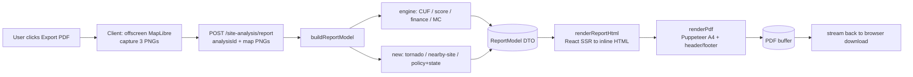

# WindPower India — Site-Analysis PDF Export
## Implementation Plan & Claude Code Runbook

*Companion to `WindPower-India_Site-Report_Content-and-DataViz-Plan.md` (the content/figure spec, figures F1–F22). This document is the **engineering plan**: architecture, phased steps, file paths, signatures, acceptance criteria, and an ordered checklist you can hand to Claude Code one PR at a time.*

*Audience: a senior engineer (or Claude Code in plan→act mode) working in your existing repo. Read **§1 Assumptions** and **Phase 0** before touching code — every later step assumes the real signatures have been confirmed.*

> **Revision 2 (post architecture review).** Accepted: endpoint rate-limiting (6.4), report version metadata (2.1), configurable browser-pool size + backpressure (5.1), richer queue metrics (6 + 9.4), and an explicit sync→async decision record (6.4). Accepted *with refinement:* nearby-site caching now uses a **quantized geospatial key** + in-flight dedupe rather than caching raw float centroids (1.3). **Partial pushback:** instead of mandating that policy data move to a DB, v1 keeps it file-backed behind a `PolicyProvider` interface so a DB-backed provider is a drop-in later (1.4) — rationale inline. Also added four items the review didn't raise: request idempotency (6.4), stored-artifact PII retention/TTL (9.3), exported-imagery tile licensing (4 + 9.3), and client-disconnect cancellation (5.1).

---

## 0. TL;DR (the shape of the build)

Generate the 6-page report **server-side** by rendering a dedicated React print template to static HTML and printing it with **headless Chromium (Puppeteer)** inside `apps/api`. The only thing the browser does is **capture the three MapLibre map images** (the live GL canvas only exists client-side) and POST them with the export request.

Why this and not client-side `html2canvas`/`react-pdf`: it reuses your chart components and types between the live UI and the PDF (DRY), produces vector-crisp multi-page A4 with native running headers/footers, is deterministic, and keeps heavy rendering off the user's machine. Trade-offs are spelled out in §3.

Critical path: **engine outputs → `ReportModel` DTO → SSR HTML → Puppeteer PDF**. Everything is testable at the `ReportModel` seam without launching Chromium.



---

## 1. Assumptions (Claude Code: verify each in Phase 0, do not trust blindly)

| # | Assumption | If wrong, do this |
|---|---|---|
| A1 | Monorepo: `apps/api` (Node + TypeScript backend) and a React web app (contains `AnalysisResults.tsx`, likely `apps/web`). | Adjust all paths to the real layout. |
| A2 | Engine exposes callable functions for CUF, scoring, finance, and the Monte-Carlo range (referenced below as `computeWindCuf`, `scoreWind`, `screenWind`, `windIrrRange`). | Read the files, record the **actual** exported names/signatures, update this plan's snippets. |
| A3 | PostGIS is reachable through an existing query layer (knex/prisma/drizzle/raw `pg`). | Use whatever the repo already uses; keep new spatial queries in that layer. |
| A4 | A `states`/admin-boundary table (or source) exists or can be added for AOI→state intersection. | Phase 1.4 includes adding it; flag as a data dependency. |
| A5 | MapLibre is initialised in the web app with a working style + tile/DEM sources + token. | Reuse that exact style config in the offscreen capture; do not fork it. |
| A6 | The API has auth/session and a request-validation convention. | Match it on the new endpoint. |
| A7 | Analysis results are either persisted (have an id) or cheaply recomputable from the AOI. | Decides whether the endpoint takes `analysisId` or the full AOI+inputs — see Phase 6. |
| A8 | Package manager + test runner are known (examples use `pnpm` + `vitest`). | Substitute the repo's tooling. |

**Senior note:** the single biggest risk in this feature is *drift between what this plan assumes and what the engine actually returns*. Phase 0 exists to kill that risk before any rendering code is written.

---

## 2. Proposed file tree (new + touched)

```
apps/api/src/services/
  analysis/
    windCuf.ts            (existing)
    windScoring.ts        (existing)
    windFinance.ts        (existing)
    screenWind.ts         (existing)
    windIrrRange.ts       (existing — EXTEND: expose draws/bins)        [P1.1]
    windSensitivity.ts    (NEW: tornado one-at-a-time)                  [P1.2]
    nearbySite.ts         (NEW: better-site candidate search)          [P1.3]
    policyContext.ts      (NEW: AOI→state intersect + policy lookup)   [P1.4]
    policyData.ts         (NEW: versioned national + per-state dataset)[P1.4]
  report/
    reportModel.ts        (NEW: ReportModel types + buildReportModel)  [P2]
    renderReportHtml.ts   (NEW: React SSR -> inline HTML)              [P3.5]
    renderPdf.ts          (NEW: Puppeteer print)                       [P5.2]
    browserPool.ts        (NEW: shared Chromium lifecycle)             [P5.1]
    reportController.ts   (NEW: endpoint handler)                      [P6.2]
    templates/
      SiteReport.tsx      (NEW: root, 6 pages)                         [P3.3]
      print.css.ts        (NEW: inlined print CSS string)             [P3.4]
      pages/Page1Cover.tsx … Page6Disclaimer.tsx   (NEW)               [P3.2]
      charts/             (NEW: pure SVG React chart components)       [P3.1]
        BandMeter.tsx ScoreComposition.tsx BulletBar.tsx CufCurve.tsx
        CashflowCumulative.tsx McIrrDistribution.tsx Tornado.tsx
        TariffStack.tsx IstsStepdown.tsx  scales.ts
  index.ts                (EXISTING — wire the new route)              [P6.3]

apps/web/src/features/site-analysis/
  AnalysisResults.tsx     (EXISTING — add Export button + flow)        [P7.1]
  report/
    mapCapture.ts         (NEW: offscreen MapLibre -> 3 dataURLs)      [P4]
    exportReport.ts       (NEW: capture + POST + download)             [P7.2]

apps/api/test/report/     (NEW: fixtures + unit/snapshot/integration)  [P8]
Dockerfile                (EXISTING/NEW — Chromium + fonts)            [P9.1]
```

---

## 3. Key engineering decisions (with rationale & trade-offs)

**D1 — Server-side Puppeteer + React SSR static template.**
Reuse chart components and the `ReportModel` type across the live UI and the PDF; vector text/charts; deterministic pagination via CSS `@page`; heavy work off the client.
*Rejected:* `html2canvas + jsPDF` (rasterises the DOM → blurry text, fragile page slicing); `@react-pdf/renderer` (real vector PDFs but forces re-implementing every chart in its primitives — no reuse with the live UI).

**D2 — Charts are pure-SVG React components, not canvas.**
SSR-able with `renderToStaticMarkup`, vector-crisp in print, no canvas paint-timing races in headless Chrome, and identical in the live UI. Use `d3-scale`/`d3-shape` for scales/paths (small, tree-shakeable) or hand-rolled math (see the mockup). *No Chart.js on the print path.*

**D3 — Map images: raster PNG captured client-side from an offscreen MapLibre instance.**
Only the browser has the live GL canvas; an *offscreen* instance (vs the visible map) gives deterministic framing independent of what the user is currently looking at. *Rejected for v1:* server-side native GL (`@maplibre/maplibre-gl-native`) — more infra, defer to a hardening pass.

**D4 — One `ReportModel` DTO is the contract between data and rendering.**
Single place to resolve nulls (`ws == null` → "N/A", never 0), attach unit strings, set the `placeholder` flags (the ₹4.50 stack), and stamp policy `asOf`/`source`. Makes the whole pipeline snapshot-testable without Chromium, and leaves room for a future docx/web export reusing the same model.

**D5 — Shared/pooled browser, never launch-per-request.**
Chromium launch is ~hundreds of ms–seconds and memory-heavy; a singleton + concurrency semaphore protects the box. Always close *pages* in `finally`.

**D6 — Feature flag + an HTML `/preview` route.**
`REPORT_PDF_ENABLED` for safe rollout; `GET …/report/preview` returns the raw SSR HTML so you can iterate on layout in a normal browser in milliseconds instead of round-tripping through Puppeteer.

---

## 4. Phase-by-phase plan

> Each step lists: **what**, **files**, **how** (with signatures), **acceptance**, **verify**, and **senior notes**. Effort tags: S ≈ <½ day, M ≈ 1–2 days, L ≈ 3+ days, for one focused engineer.

### Phase 0 — Recon & scaffolding (S)

**0.1 Read the engine, record reality.** Open `windCuf.ts`, `windScoring.ts`, `windFinance.ts`, `screenWind.ts`, `windIrrRange*`, `index.ts`, and `AnalysisResults.tsx`. Write down the exact exported names, input params, and return shapes (especially: does finance return the full 20-yr cashflow series? what fields does the MC range return today? how is `ws == null` represented downstream?).
*Acceptance:* a short "engine surface" note (paste into the PR description) listing real signatures. *Verify:* signatures compile when imported from a scratch file.

**0.2 Confirm stack facts (A1–A8).** Web framework (Express/Fastify/Nest?), DB layer, MapLibre style/token location, package manager, test runner.

**0.3 Add dependencies.**
```bash
# apps/api
pnpm add puppeteer            # or: puppeteer-core + @sparticuz/chromium (serverless)
pnpm add zod d3-scale d3-shape
pnpm add -D vitest pdf-lib    # pdf-lib for asserting page count in tests
# react / react-dom are likely already present; if not:
pnpm add react react-dom
```
*Senior note:* if you deploy to Lambda/Cloud Run-min, prefer `puppeteer-core` + `@sparticuz/chromium`; if you run a normal container, full `puppeteer` (bundled Chromium) is simpler — decide now, it affects Phase 9.

**0.4 Scaffold the module + flag.** Create empty `apps/api/src/services/report/` files from the tree, and add `REPORT_PDF_ENABLED` to config.
*Acceptance:* app builds with empty stubs; flag readable. *Verify:* `pnpm -C apps/api build`.

---

### Phase 1 — Extend the data layer (M)

These are the four computations the report needs that the engine doesn't emit yet (from the content-plan gap list). Keep them **next to the engine**, pure, and deterministic.

**1.1 Expose Monte-Carlo distribution (extend `windIrrRange.ts`).**
Today it returns P10–P90. Add a server-side histogram so figure F16 can be drawn without shipping 4000 floats.
```ts
export interface WindIrrRange {
  p10: number; p25: number; p50: number; p75: number; p90: number;
  histogram: { binEdges: number[]; counts: number[] }; // ~24 bins over observed range
  equityIrrDraws?: number[];   // raw draws, only when opts.includeDraws (debug)
}
export function windIrrRange(inputs: WindFinanceInputs, opts?: { includeDraws?: boolean }): WindIrrRange
```
*Acceptance:* percentiles unchanged vs current output; same seed → identical histogram across runs. *Verify:* unit test asserts determinism and that `p50` falls in the modal bin. *Senior note:* bin server-side (≤24 buckets) to keep the payload tiny; gate raw draws behind a debug flag.

**1.2 Tornado sensitivity (`windSensitivity.ts`).**
One-at-a-time: hold all eight sampler variables at their triangular **mode**, swing each to its tri-**min** then tri-**max**, recompute the *deterministic* equity IRR, record the deltas.
```ts
export interface TornadoRow { variable: 'PPA'|'CUF'|'CAPEX'|'interest'|'REC'|'TOD'|'OM'|'carbon';
  lowIrr: number; highIrr: number; deltaLow: number; deltaHigh: number; }
export interface WindSensitivity { baseIrr: number; rows: TornadoRow[]; } // rows sorted by max(|delta|) desc
export function windSensitivity(inputs: WindFinanceInputs): WindSensitivity
```
*Acceptance:* `baseIrr` (all modes) equals the deterministic equity IRR within 1e-6; lower CAPEX → higher IRR (sign sanity); rows sorted by influence. *Verify:* unit test on a fixed input asserts ordering (expect PPA/CUF/CAPEX on top) and sign of each swing.
*Senior note:* reuse the **exact** finance function from `windFinance.ts`/`screenWind.ts` — do not re-derive the waterfall, or the tornado will silently disagree with the headline IRR.

**1.3 Nearby better-site search (`nearbySite.ts`).**
Scan candidate points around the AOI centroid, score + screen each, return the best that is strictly better at the **same capacity/area**.
```ts
export interface NearbySiteResult {
  found: boolean;
  candidate?: { lat: number; lon: number; distanceKm: number;
    ws: number; cuf: number; score: number; lineKm: number; subKm: number;
    equityIrr: number; npvCr: number; paybackYr: number; };
  deltas?: Partial<Record<'ws'|'cuf'|'score'|'lineKm'|'subKm'|'equityIrr'|'npvCr'|'paybackYr', number>>;
  reason?: string; // when !found, e.g. "no higher-scoring site within 10 km"
}
export async function findNearbyBetterSite(args: {
  centroid: LngLat; areaKm2: number; radiusKm?: number; selected: SiteScore;
}): Promise<NearbySiteResult>
```
*How:* generate a bounded candidate set (concentric rings or a coarse grid, hard-capped at e.g. 24 points), **batch** the GWA raster reads and the PostGIS distance queries (single KNN/`<->` query over a `VALUES` list — never N queries in a loop), run `scoreWind` + `screenWind`, rank by composite score then equity IRR, keep only strictly-better, return best + deltas.
*Acceptance:* returns `{found:false, reason}` cleanly when nothing beats the selected site; respects radius; bounded query count; completes under a hard timeout. *Verify:* unit test with a stubbed raster/grid for both the "found" and "none" paths.
*Senior note:* this is the one step that can blow up latency. Cap candidates, batch I/O, memoise raster reads, and give it its own timeout that degrades to `found:false` rather than failing the export.

*Caching (review revision).* The review asked to cache nearby-site results. Do it, but **don't key on the raw centroid** — float lat/lon never repeat, so a naïve cache has a ~0% hit rate. Quantize first: snap the centroid to a grid cell (~500 m, or an H3 res-7/8 cell) and key on `(cell, areaKm2 bucket, radiusKm, policyVersion, engineVersion)`. Cache the **I/O-bound** part (per-cell GWA raster reads + PostGIS distances) more aggressively than the final ranking, since neighbouring AOIs share cells. Use an in-process LRU first (a single box needs nothing more); reach for Redis only when you run multiple API instances — don't make Redis a launch dependency. Add **in-flight dedupe** (a promise map keyed the same way) so two concurrent exports of the same cell compute once. TTL ~24 h, and bust on `policyVersion`/`engineVersion` change.

**1.4 State intersection + policy lookup (`policyContext.ts` + `policyData.ts`).**
```ts
export interface PolicyContext {
  asOf: string;                       // ISO date the dataset was last reviewed
  national: NationalPolicy;           // RCO ramp, ISTS step-down, REC buyout, fiscal
  states: StatePolicy[];              // one card per intersected state (1–3 typical)
}
export async function getPolicyContext(aoi: GeoJSONPolygon): Promise<PolicyContext>
```
*How:* `ST_Intersects(aoi, states.geom)` → state codes; resolve each state's policy through a **`PolicyProvider`** (below), not by importing a data file directly. Degrade to national-only if no state matches.
```ts
export interface PolicyProvider {
  getNational(): Promise<NationalPolicy>;
  getStates(codes: string[]): Promise<StatePolicy[]>;
  version(): string;   // stamped into ReportMetadata.policyAsOf / cache keys
}
// v1: reads the reviewed policyData.ts module (national + per-state, each field { value, effectiveDate, source }).
export class StaticPolicyProvider implements PolicyProvider { /* … */ }
// later/prod: reads a policy_rules table (state, field, value, effective_date, source, reviewed_at) with no code change elsewhere.
export class DbPolicyProvider implements PolicyProvider { /* … */ }
```
`getPolicyContext` depends only on the interface; the concrete provider is injected. The `states.geom` table stays in PostGIS regardless — only the **rule values** swap backends.
*Acceptance:* a multi-state AOI returns multiple `states`; every figure has a `source`; `asOf` (= `provider.version()`) is rendered later; swapping providers needs no template/controller change. *Verify:* unit test with a polygon straddling two states, run against `StaticPolicyProvider`.

*Partial pushback on the review.* The review wanted `policyData.ts` moved into the database outright. I'd hold that for v1 and ship the interface instead, for three reasons. (1) **Cadence:** these rules change on a quarterly-ish regulatory cycle, not per request — this is reference data, not transactional state. (2) **Provenance & review:** a versioned file edited via PR gives you diff history, code review, and a blameable change record for "why did the wheeling charge change" — better governance than a hand-edited DB row, which is exactly what you want for numbers that end up in a client-facing finance report. (3) **Cost:** a DB table adds a migration, a query path, and an admin surface for zero functional gain at launch. The interface keeps the door open: when a non-engineer needs to edit policy without a deploy, drop in `DbPolicyProvider` (it's PR15) and nothing else moves. Net: accept the *intent* (don't bury policy in template logic), defer the *mechanism* (DB) until there's an editor who isn't an engineer.

*Senior note:* policy is **content, not computation**. Keep it out of the template and out of code logic; the provider is the only seam that touches it. Treat the engine's ₹4.50 stack as *indicative* and keep it visually separated from these sourced policy values.

---

### Phase 2 — ReportModel, the contract (M)

**2.1 Define types (`reportModel.ts`).** One DTO holding everything the template renders — header/site meta, the three `mapImages` (dataURLs), site data (resource + grid + score + confidence + energy), `policy` (from 1.4), figure data, `nearbySite` (from 1.3), static methodology/sources/contact, and a **`meta` block** (below). Every numeric field carries its rendered unit; nullable wherever the engine is nullable; `placeholders: { effTariff: true }`.

```ts
export interface ReportMetadata {
  generatedAt: string;       // ISO timestamp of render
  reportVersion: string;     // template/report layout version, e.g. "1.0.0"
  engineVersion: string;     // pinned analysis-engine version (CUF/score/finance)
  modelSchemaVersion: string;// ReportModel shape version — guards snapshot tests
  policyAsOf: string;        // = PolicyProvider.version()
  inputsHash: string;        // stable hash of {aoi, inputs, mapImage digests} — repro + idempotency key
}
```
*Why (accepts review P0.4):* every exported PDF must be reproducible and self-identifying. `inputsHash` doubles as the idempotency / dedupe key (6.4); `engineVersion` + `modelSchemaVersion` let you tell "the engine changed" from "the layout changed" when an old PDF is questioned. Rendered in the page-6 footer/colophon.

**2.2 Builder (`buildReportModel`).**
```ts
export async function buildReportModel(input: {
  analysis: AnalysisResult;          // engine outputs (or recompute upstream)
  aoi: GeoJSONPolygon; centroid: LngLat; areaKm2: number;
  mapImages: { street: string; terrain: string; threeD: string }; // validated dataURLs
}): Promise<ReportModel>
```
Orchestrates engine outputs + 1.1–1.4, normalises (`ws == null` → `"N/A"`), attaches placeholder flags and `source`/`asOf`. **Pure** — no rendering, no Puppeteer.
*Acceptance:* golden snapshot of the model for a fixed input; a null-resource input produces "N/A" fields and `null` financials (never 0). *Verify:* `vitest` snapshot + a null-resource case.
*Senior note:* this seam is your test surface and your future-format seam (docx/web). Keep all conditional logic (multi-state, no-nearby, null-resource) **here**, so the template stays dumb.

---

### Phase 3 — Print template: SSR + SVG charts + CSS (L)

**3.1 Chart primitives (`templates/charts/*`).** Pure props→SVG React components, one per figure: `BandMeter`, `ScoreComposition`, `BulletBar`, `CufCurve`, `CashflowCumulative` (payback), `McIrrDistribution`, `Tornado`, `TariffStack`, `IstsStepdown`. Compute scales with `d3-scale` (`scales.ts`) or the closed-form math from the mockup.
*Acceptance:* each renders to a string via `renderToStaticMarkup` with **no** DOM/browser; output matches the approved mockup. *Verify:* per-component snapshot test.
*Senior note:* keep them deterministic and side-effect-free — pass pre-computed data from the model; no fetching, no `useEffect`, no random.

**3.2 Page components (`templates/pages/Page1…Page6`).** Each consumes its `ReportModel` slice and renders one `<section class="page">`. Map images via ``. Conditionals (1 vs 3 state cards, no-nearby fallback, N/A states) are read from the model, not computed here.

**3.3 Root (`SiteReport.tsx`).** Composes the six pages in order.

**3.4 Print CSS (`print.css.ts`, exported as an inlined string).**
```css
@page { size: A4; margin: 16mm 14mm 14mm 14mm; }
.page { break-after: page; }
.page:last-child { break-after: auto; }
.card, .figure { break-inside: avoid; }
* { -webkit-print-color-adjust: exact; print-color-adjust: exact; }
@font-face { font-family: 'Brand'; src: url(data:font/woff2;base64,…) format('woff2'); }
```
*Senior note:* the running **logo header + page numbers** are done by Puppeteer's native header/footer (Phase 5), not CSS — so reserve top/bottom margin for them here, and don't duplicate them in the page bodies.

**3.5 `renderReportHtml(model): string`.** `renderToStaticMarkup(<SiteReport model={model}/>)`, then wrap in a full HTML doc string with the inlined `<style>` and **base64-embedded fonts**. Returns a self-contained string with zero external network references.
*Acceptance:* the returned HTML opens correctly in a plain browser (this is what `/preview` serves). *Verify:* eyeball via the preview route added in Phase 6.
*Senior note:* inline everything (CSS, fonts) so Chromium needs no network → faster, reproducible, container-friendly. **Confirm the embedded font has the ₹ glyph** (and Indic glyphs if any state names render in Indic) — missing-glyph tofu in a finance report is a credibility killer.

---

### Phase 4 — Client map capture (M)

**4.1 `mapCapture.ts`.** Create a hidden offscreen MapLibre map sized to the target aspect (e.g. 1200×800), reusing the app's style/token, with `canvasContextAttributes: { preserveDrawingBuffer: true }` and DEM **terrain + hillshade** sources (separate sources, per MapLibre guidance).

**4.2 Capture the three cameras.** For each shot, set the camera, add the AOI polygon + centre marker, wait for readiness, then read the canvas:
```ts
async function shot(map: maplibregl.Map): Promise<string> {
  await once(map, 'idle');                 // tiles + terrain settled
  return map.getCanvas().toDataURL('image/png');
}
// street  : top-down, fitBounds(AOI), base style
// terrain : top-down + hillshade layer
// threeD  : pitch ~60°, setTerrain({ exaggeration: 1.4 })
```
Return `{ street, terrain, threeD }` and **destroy** the offscreen map.
*Acceptance:* three non-blank PNGs at target size with the AOI visible and consistent framing. *Verify:* dev harness renders the three dataURLs into `` tags.
*Senior notes:* wait for both `idle` **and** the DEM source `data` event before the 3D capture (terrain loads async); cap resolution and total payload size; handle `webglcontextlost`; wrap each shot in a timeout and **skip a failed shot rather than failing the whole export** (the model can render a placeholder for a missing image); respect the tile provider's TOS for exported imagery + attribution.

---

### Phase 5 — Render service: Puppeteer (M)

**5.1 `browserPool.ts`.** Lazily launch **one** shared browser; health-check and relaunch if disconnected; graceful shutdown on `SIGTERM`; a concurrency semaphore whose size is **`REPORT_BROWSER_POOL_SIZE` (default 4)** — env-configurable per box size (accepts review P1.5), not a magic number in code.
```ts
export async function withPage<T>(
  fn: (page: Page) => Promise<T>,
  opts?: { signal?: AbortSignal; acquireTimeoutMs?: number }, // default acquireTimeoutMs ~3000
): Promise<T>
// 1. await a permit, but bounded: if none free within acquireTimeoutMs → throw PoolBusyError → caller returns 503 Retry-After.
// 2. if opts.signal already aborted (client disconnected) → bail before launching a page.
// 3. acquire page; race fn(page) against signal → on abort, page.close() and stop work.
// 4. guarantee page.close() in finally; release the permit in finally.
```
*Backpressure, not an unbounded queue.* When all permits are busy, callers wait **only** up to `acquireTimeoutMs`, then get `PoolBusyError`; the controller maps that to **503 + Retry-After** (5.2/6.x). Never let requests pile into an unbounded in-memory queue — that just converts a latency spike into an OOM. Pair this with the endpoint rate-limit (6.4) so the 503 path is rare.
*Cancellation.* Thread an `AbortSignal` from the request (Express `req.on('close')` / Fastify `request.raw.on('close')`) through `withPage` so a user who navigates away or times out frees the browser page immediately instead of holding a permit for a render nobody will read.
*Acceptance:* pool size honours the env var; the N+1th concurrent request gets 503 (not a hang); aborting the client request closes the page within ~1 render-loop tick. *Verify:* a concurrency test that fires `poolSize + 2` requests asserts ≤`poolSize` active pages and that the overflow returns 503.

**5.2 `renderPdf(html, opts): Buffer`.**
```ts
await page.setContent(html, { waitUntil: 'networkidle0' });
await page.evaluateHandle('document.fonts.ready');
const pdf = await page.pdf({
  format: 'A4', printBackground: true, preferCSSPageSize: true,
  displayHeaderFooter: true, headerTemplate, footerTemplate,
  margin: { top: '16mm', bottom: '14mm', left: '14mm', right: '14mm' },
});
```

**5.3 Header/footer templates.** Chromium header/footer are isolated documents that **do not inherit page CSS** and default to ~6px text — set explicit inline `font-size`. Header: inline **base64 logo** + "WindPower India" + site id/date. Footer: `Page <span class="pageNumber"></span> of <span class="totalPages"></span>` + the "screening report — not bankable" microcopy.
*Acceptance:* a 6-page A4 PDF, header/footer on **every** page, band colours preserved, size within budget (target < 3–5 MB), render < ~5–8 s for a typical site. *Verify:* integration test (Phase 8.3).
*Senior notes:* never launch per request (D5); always `page.close()` in `finally`; set hard nav + pdf timeouts; in a container use a real Chromium with fonts installed (Phase 9) — `--no-sandbox` **only** under container isolation, and document why.

---

### Phase 6 — API endpoint & wiring (S–M)

**6.1 Route.** `POST /api/site-analysis/report`. Body (zod-validated): `analysisId` *or* `{ aoi, inputs }` (per A7), plus `mapImages` (three dataURLs). Enforce auth, the feature flag, and a strict size cap + mime allow-list (`image/png|jpeg` only) on the images.

**6.2 Controller (`reportController.ts`).** `buildReportModel` → `renderReportHtml` → `withPage(renderPdf)` → respond `application/pdf` (stream) with `Content-Disposition: attachment; filename="windpower-site-WP-….pdf"`. On failure return structured JSON (never a half-written PDF).

**6.3 Wire in `index.ts`** alongside the existing analysis routes. Add **`GET /api/site-analysis/report/preview`** (flag-gated, non-prod) returning `renderReportHtml(...)` as `text/html` for fast layout iteration.
*Acceptance:* `curl` returns a valid 6-page PDF; preview renders the HTML; bad input → 400 with a clear message. *Verify:* Phase 8.3.
*Senior notes:* see **6.4** for rate-limit / idempotency / metrics / sync-vs-async (these were the review's P0.2, P1.6, P1.7). **No server-side fetching of user-supplied URLs** — keep the no-SSRF posture by only accepting inline image data.

**6.4 Rate-limit, idempotency, metrics & the sync→async decision record.**

*Rate-limit (accepts review P0.2).* Per-user token bucket, **`PDF_EXPORT_RATE_LIMIT` (default 5 / user / hour)**; on exceed return **429 + `Retry-After`**. This is a different lever from the pool's 503: 429 = "you personally asked too often", 503 = "the box is momentarily full" (5.1). Both must exist — the rate-limit stops one user monopolising a heavy endpoint; the pool backpressure stops the box falling over.

*Idempotency / dedupe (gap the review missed).* A double-click or a client retry must not run Chromium twice. Key on `ReportMetadata.inputsHash` (2.1): keep a short-TTL in-flight map so a duplicate request **joins** the running render instead of starting a new one, and (optionally) a brief result cache so an immediate re-request returns the same bytes. Cheap, and it removes the most common source of accidental double-load.

*Metrics (accepts review P1.6).* Emit per request: `modelBuildMs`, **`mapCaptureMs`** (client-reported, passed in the request), `renderMs`, **`browserQueueWaitMs`** (time spent waiting for a pool permit — the early-warning signal that you need a bigger pool or the async path), `pageCount`, `pdfBytes`, outcome (`ok` / `429` / `503` / `error`). On error, persist the failing `ReportModel` snapshot for repro (subject to the retention rules in 9.3).

*Sync→async decision record (accepts review P1.7).* **v1 is synchronous** — one request, hard timeout, stream the PDF back. It's simpler, needs no queue infra, and is correct at low volume. **Migrate to an async job (submit → poll/SSE → download) when any trigger fires:** p95 `renderMs + browserQueueWaitMs` > ~10 s sustained; `browserQueueWaitMs` regularly non-zero (demand > pool); 503 rate from 5.1 climbs above a small threshold; or you need cross-instance fan-out. **Target when triggered:** BullMQ + Redis (if already on Redis) or SQS + a dedicated render worker, with the existing `inputsHash` as the job id (idempotent jobs for free). Record *this paragraph* as the ADR so the next engineer doesn't re-litigate it.
*Acceptance:* the 6th export in an hour returns 429; a duplicate in-flight request produces one render, not two; the metric fields appear in logs. *Verify:* a rate-limit unit test + a dedupe test firing two identical requests concurrently and asserting a single render.

---

### Phase 7 — Frontend export flow (S–M)

**7.1** Add an "Export report (PDF)" button to `AnalysisResults.tsx` near `FinancialsBlock`, disabled until an analysis with non-null resource is present.

**7.2 `exportReport.ts`:** on click → progress UI → `mapCapture()` → `POST` model inputs + images → receive the PDF blob → trigger download → toast on success/failure.
*Acceptance:* click → file downloads within a few seconds; capture and render have distinct progress states; double-submit is blocked. *Verify:* manual + a component test mocking the endpoint.
*Senior note:* surface two phases to the user ("Capturing maps…", "Rendering report…") — the capture step can be the slow/janky one and users should know it's working.

---

### Phase 8 — Testing & verification (M)

**Fixtures** (drive everything off four `ReportModel` inputs): `high-wind`, `null-resource`, `multi-state`, `no-nearby`.

| Level | What | Tool |
|---|---|---|
| 8.1 Unit | tornado ordering/signs; nearbySite found + none paths; policyContext multi-state; `windIrrRange` determinism | vitest |
| 8.2 Snapshot | `buildReportModel` golden JSON; `renderReportHtml` HTML snapshot | vitest |
| 8.3 Integration | endpoint returns PDF; parse with `pdf-lib` and assert **page count == 6**; size within bounds; extracted text contains site id + key metrics | vitest + pdf-lib |
| 8.4 Visual regression *(optional)* | render fixtures → `pdftoppm` to PNG per page → `pixelmatch` vs baseline with tolerance | pixelmatch + pngjs |
| 8.5 Manual QA | print colours, page breaks, header/footer on all pages, **null-resource shows N/A not 0**, multi-state page 3, no-nearby fallback, ₹/Indic glyphs render | `/preview` + printed PDF |

*Senior note:* the `/preview` route + the four fixtures **are** your test matrix — wire them into CI so a layout regression fails the build, not a reviewer's eyes.

---

### Phase 9 — Hardening, perf, deployment (M)

**9.1 Container.** Dockerfile installs Chromium + fonts (Latin incl. ₹ glyph, plus Indic if needed), sets `PUPPETEER_EXECUTABLE_PATH`, runs as non-root; `--no-sandbox` only with proper container isolation (document the decision).
**9.2 Resource limits.** Memory ceiling, page/nav/pdf timeouts, the configurable concurrency cap + bounded-wait 503 backpressure from 5.1 (no unbounded queue); move to a dedicated render worker via the async path when the 6.4 triggers fire.
**9.3 Security & data retention.** Auth; zod validation; base64 size cap + mime allow-list; HTML-escape every user-supplied string rendered into the template; maintain the no-SSRF posture (no remote fetches). **Stored-artifact retention (gap the review missed):** if you persist anything — generated PDFs, cached nearby-site results, or the failing-`ReportModel` debug snapshots from 6.4 — treat it as data with a lifecycle. A site report ties a coordinate to financial figures, so the PDF and the debug snapshot are mildly sensitive: store them access-controlled (owner-scoped, signed URLs if served), set a **TTL/auto-purge** (e.g. debug snapshots 30 d, result cache 24 h), and don't log full image dataURLs (log digests). **Exported-imagery licensing (gap the review missed):** a downloadable PDF *redistributes* map tiles/satellite imagery — confirm the tile/imagery provider's license permits export and that required attribution is burned into the map images or page-6 sources; this is a different permission from showing tiles in the live app. (Capture-time attribution is noted in Phase 4.)
**9.4 Observability.** Structured logs + the full timing metric set from **6.4** (`modelBuildMs`, `mapCaptureMs`, `renderMs`, `browserQueueWaitMs`, `pageCount`, `pdfBytes`, outcome) + error capture; alert on rising `browserQueueWaitMs` / 503 rate (the documented async-migration trigger); the `REPORT_PDF_ENABLED` flag as a kill switch.
**9.5 Rollout.** Flag on internal → beta → GA; write a one-page runbook (how to read logs, how to repro from a saved model snapshot, how to flip the flag).

---

## 5. Risks & mitigations

| Risk | Likelihood | Impact | Mitigation |
|---|---|---|---|
| Engine signatures differ from assumptions | High | High | Phase 0 recon before any rendering code; the `ReportModel` seam absorbs shape changes |
| Map capture flaky (terrain/tiles async, WebGL context loss) | Med | Med | wait for `idle` + DEM `data`; per-shot timeout; skip-and-placeholder instead of hard-fail |
| Puppeteer memory/latency under load | Med | High | pooled browser + concurrency cap + timeouts; async-job path documented as the scale-out |
| `nearbySite` latency blowup | Med | Med | hard candidate cap + batched I/O + own timeout degrading to `found:false` |
| Missing ₹/Indic glyphs → tofu | Med | Med | embed a font with required glyphs; QA fixture checks it |
| Placeholder ₹4.50 tariff mistaken for real | Med | High | persistent "indicative" badge + page-6 disclaimer; policy values visually separated with sources |
| Header/footer styling surprises (isolated doc, tiny default font) | High | Low | explicit inline font-size; verified in 8.5 |
| Duplicate renders from double-click / client retry waste a Chromium run | Med | Med | idempotency via `inputsHash` + in-flight dedupe (6.4) |
| Overload: many concurrent exports exhaust memory | Med | High | configurable pool + bounded wait → 503 backpressure (5.1); per-user 429 rate-limit (6.4) |
| Stored PDFs / debug snapshots leak coordinate↔finance data | Low | Med | access-controlled storage, TTL/auto-purge, log digests not dataURLs (9.3) |
| Exported map imagery violates tile-provider license | Low | Med | confirm export rights + burn-in attribution before GA (4, 9.3) |
| Policy data goes stale between regulatory cycles | Med | Med | `PolicyProvider.version()` stamped on every report; quarterly review owner; `DbPolicyProvider` (PR15) when a non-engineer must edit |

---

## 6. Out of scope (v1) & open questions

**Out of scope:** solar/hybrid/BESS (no GHI raster — wind-only, consistent with the engine); editable-assumptions UI; server-side native map rendering; bankable-grade energy uncertainty (P-values stay on IRR, not AEP).

**Open questions (resolve before/while building):**
1. **CECL vs CERC** on page 6 — confirm CECL is your own consultancy contact (assumed) and provide details; CERC is the regulator, not a "contact for bankable report."
2. Endpoint input: `analysisId` (results persisted) **or** recompute from AOI? (A7)
3. Sync render vs async job — confirm the latency ceiling / 503 threshold that should trigger the documented async migration (6.4 records the defaults).
4. `states` boundary table — does one exist, or add it? Who owns refreshing `policyData.ts`?
5. OK to embed a brand font with ₹ + Indic glyphs? Which logo asset (SVG preferred) for the header?
6. Deploy target (normal container vs serverless) — decides `puppeteer` vs `puppeteer-core + @sparticuz/chromium`.
7. Is Redis available? Decides whether the nearby-site cache (1.3) and the future async queue (6.4) use in-process LRU or shared Redis — affects single- vs multi-instance scaling, **not** a launch blocker.
8. Confirm the production numbers left as defaults: `PDF_EXPORT_RATE_LIMIT` (5/user/hr), `REPORT_BROWSER_POOL_SIZE` (4), and the retention windows for stored PDFs / debug snapshots (9.3).
9. Does the map tile/imagery provider's license permit redistribution in an exported PDF, and what attribution must be burned in? (4, 9.3) — confirm before GA.

---

## 7. Definition of done
A logged-in user, viewing a completed site analysis, clicks **Export report (PDF)** and within a few seconds downloads a 6-page A4 PDF that: carries the logo + "WindPower India" header and page numbers on every page; shows the three maps, all computed site data (N/A-safe), the selected-state(s) + national policy with sources, the resource + finance figures (F1–F22), a nearby better-site comparison (or a graceful "none found"), and a disclaimer/methodology/sources/contact page — all behind a feature flag, covered by the four-fixture test matrix.

---

## 8. Claude Code execution order (ordered, PR-sized)

Drive this in **plan→act**, one PR per row, run `/preview` + tests after each. Read before you write.

```
[ ] PR0  Phase 0      Recon note (engine surface) + deps + module scaffold + flag
[ ] PR1  Phase 1.1    Extend windIrrRange with histogram (+ determinism test)
[ ] PR2  Phase 1.2    windSensitivity (tornado) + unit test
[ ] PR3  Phase 1.4    policyData + PolicyProvider interface + StaticPolicyProvider + policyContext (AOI→state) + multi-state test
[ ] PR4  Phase 1.3    nearbySite candidate search (found + none) + quantized-key cache + in-flight dedupe + test
[ ] PR5  Phase 2      ReportModel types (incl. ReportMetadata meta block) + buildReportModel + golden snapshot
[ ] PR6  Phase 3.1    SVG chart components + per-component snapshots
[ ] PR7  Phase 3.2-5  Pages (page-6 renders meta block) + print.css + renderReportHtml
[ ] PR8  Phase 6.3    /preview route (iterate layout here before Puppeteer)
[ ] PR9  Phase 4      Client mapCapture (offscreen MapLibre) + burn-in tile attribution
[ ] PR10 Phase 5      browserPool (configurable size + bounded-wait 503 + AbortSignal cancel) + renderPdf + header/footer
[ ] PR11 Phase 6      POST /report endpoint (validation, auth, flag) + 6.4 rate-limit + idempotency/dedupe + metrics
[ ] PR12 Phase 7      Frontend Export button + exportReport flow
[ ] PR13 Phase 8      Integration + visual-regression tests in CI
[ ] PR14 Phase 9      Dockerfile (Chromium+fonts), limits, retention/TTL + attribution, observability, rollout
[ ] PR15 (scale-out)  DbPolicyProvider (when a non-engineer must edit policy) + async job queue (when 6.4 triggers fire)
```

**Guardrails for each PR:** confirm real signatures from the repo (not this doc's snippets); keep `buildReportModel` pure; close Chromium pages in `finally`; never render `0` for a null resource; keep the ₹4.50 stack badged "indicative" and separate from sourced policy values.
